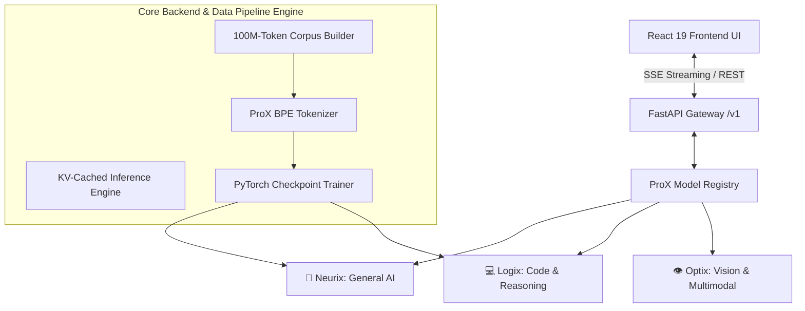

# ⚡ ProX AI — Training Corpus Pipeline & Google Colab Training Guide (0 to 100)

> **Next-Generation Modular AI Ecosystem, specialized Neural Architectures (Neurix, Logix, Optix), and Reproducible 100M-Token Pre-Training Pipeline v0.1**

ProX AI is a full-stack, modular artificial intelligence platform featuring specialized model families (**Neurix**, **Logix**, and **Optix**), custom PyTorch pre-training & inference engines, a high-throughput streaming dataset pipeline, and a modern React 19 web application.

---

## 🌟 Architectural Overview



---

## 📊 ProX Training Corpus v0.1 (100M Token Architecture)

The pre-training corpus pipeline converts dataset ingestion from document-count limits to a **token-budget-driven sampling system** using `ProXTokenizer`.

### Target Token Distribution (100,000,000 Total Usable Tokens)

| Category Key | Target Percentage | Target Token Count | Primary Source Datasets | Provenance & License |
| :--- | :--- | :--- | :--- | :--- |
| `general_natural_language` | **50%** | **50,000,000** | FineWeb-Edu (`sample-10BT`, score $\ge 3$) / Wikipedia | ODC-By 1.0 / CC-BY-SA |
| `programming_languages` | **30%** | **30,000,000** | The Stack Smol / CodeParrot Clean (Python, C, C++ [`data/c++`], JS, TS, Rust, Go, Java) | BigCode Terms / Apache-2.0 |
| `technical_documentation` | **15%** | **15,000,000** | CodeXGlue NL-Code Search & AG News Sci/Tech | Apache-2.0 / Academic |
| `mathematics_reasoning` | **5%** | **5,000,000** | OpenWebMath (`open-web-math/open-web-math`) | ODC-By 1.0 / CC |

---

## 🛠️ Pipeline Features & Quality Controls

1. **Token Budget Ingestion**: Real-time token accounting via `ProXTokenizer.encode()`.
2. **Quality Filtering (`DatasetQualityPipeline`)**:
   - Length boundary filtering ($20 \le \text{chars} \le 100,000$)
   - 10-gram repetition ratio filtering ($\le 0.45$)
   - Python AST syntax parse validation
3. **Scalable Deduplication (`DatasetDeduplicator`)**:
   - Exact SHA-256 fingerprint deduplication
   - MinHash & Jaccard n-gram near-duplicate removal
4. **Deterministic Stratified Train/Val Split**:
   - Hash-seeded 90% train / 10% validation split preserving category, language, and dataset representation.
5. **Data Leakage Checker (`DataLeakageChecker`)**:
   - Ensures $0\%$ exact/near leakage between train and validation partitions.
6. **Zero Repository Contamination**:
   - Strict isolation ensuring local repository build code/scripts never enter the pre-training dataset.
7. **Sharded Output Storage**:
   - Generates streaming `.jsonl` / `.jsonl.zst` sharded output files (`train/`, `validation/`, `raw/`, `processed/`, `deduplicated/`).
8. **Checkpoints & Resumability**:
   - Supports `--resume` using `prox_training_corpus/checkpoints/checkpoint_state.json`.

---

## 🚀 STEP-BY-STEP GOOGLE COLAB TRAINING GUIDE (0 TO 100)

Follow this complete step-by-step guide to run corpus building, tokenizer training, model pre-training, and model deployment on **Google Colab** (Free T4 or Premium A100 GPU).

---

### Step 1: Open Google Colab & Select GPU Runtime

1. Go to [Google Colab](https://colab.research.google.com/).
2. Create a **New Notebook**.
3. In the menu, go to **Runtime** $\rightarrow$ **Change runtime type**.
4. Select **T4 GPU** (or **A100 GPU** if available) and click **Save**.

---

### Step 2: Clone Repository & Setup Working Directory

Run this in Colab Cell 1:

```python
# Cell 1: Clone ProX AI Repository & Set Working Directory
import os
if not os.path.exists("/content/ProX-AI"):
    !git clone https://github.com/ProXentix/ProX-AI.git /content/ProX-AI
%cd /content/ProX-AI

# Verify GPU availability
import torch
print("PyTorch Version:", torch.__version__)
print("CUDA Available:", torch.cuda.is_available())
if torch.cuda.is_available():
    print("GPU Device Name:", torch.cuda.get_device_name(0))
```

---

### Step 3: Install Required Dependencies

Run this in Colab Cell 2:

```python
# Cell 2: Install Dependencies
!pip install -q -r requirements.txt
!pip install -q zstandard datasets tokenizers fastapi uvicorn
```

---

### Step 4: (Optional) Set Hugging Face Token

Setting `HF_TOKEN` increases Hugging Face API rate limits for high-speed streaming:

```python
# Cell 3: Set Hugging Face Token (Optional)
import os
os.environ["HF_TOKEN"] = "your_hf_token_here"  # Replace or leave empty for public datasets
```

---

### Step 5: Build Pre-Training Corpus

You can build a **Small Test Corpus (100k tokens)**, **Medium Test Corpus (1M tokens)**, or the full **100M Token Corpus**.

#### Option A: Build 100k Test Corpus (Fast Validation - ~1 min)
```python
# Cell 4: Run 100k Token Test Build
!PYTHONPATH=. python scripts/build_prox_corpus.py --target-tokens 100000
```

#### Option B: Build Full 100M Token Corpus (~15-30 mins)
```python
# Cell 4 (Alternative): Run Full 100M Token Build
!PYTHONPATH=. python scripts/build_prox_corpus.py --target-tokens 100000000
```

*Note: If disconnected, resume anytime with:*
```python
!PYTHONPATH=. python scripts/build_prox_corpus.py --target-tokens 100000000 --resume
```

---

### Step 6: Inspect Generated Corpus Manifests & Reports

Run this in Colab Cell 5:

```python
# Cell 5: Inspect Build Report & Manifest
import json

with open("prox_training_corpus/manifests/corpus_manifest_v0.1.json", "r") as f:
    manifest = json.load(f)

print("--- CORPUS MANIFEST SUMMARY ---")
print("Total Usable Tokens:", f"{manifest['summary_statistics']['total_usable_tokens']:,}")
print("Train Tokens:       ", f"{manifest['summary_statistics']['train_tokens']:,}")
print("Validation Tokens:  ", f"{manifest['summary_statistics']['val_tokens']:,}")
print("Corpus Hash:        ", manifest["corpus_hash"])
print("Build Status:       ", "PASSED" if manifest["summary_statistics"]["target_reached"] else "PARTIAL BUILD")

# Display Category Distribution
print("\n--- CATEGORY BREAKDOWN ---")
for cat, data in manifest["category_distribution"].items():
    print(f"  • {cat:<28}: {data['tokens']:,} tokens ({data['actual_percentage']}%)")
```

---

### Step 7: Train / Freeze ProX Tokenizer

Run this in Colab Cell 6:

```python
# Cell 6: Train BPE Tokenizer on Built Corpus
!python -m backend.tokenizer.train_tokenizer --dataset prox_training_corpus/train --output weights/tokenizer/tokenizer.json --vocab-size 32000
```

---

### Step 8: Launch PyTorch Neurix-100M Pre-Training

Run this in Colab Cell 7:

```python
# Cell 7: Launch GPU Accelerated Model Pre-Training
!python -m backend.training.train --config configs/neurix-100m-training.yaml
```

During training, the PyTorch engine outputs loss metrics, throughput (tokens/sec), VRAM utilization, and saves model checkpoints to `weights/neurix-100m/`.

---

### Step 9: Launch FastAPI Server & Expose via Public URL

Run this in Colab Cell 8 to launch the OpenAI-compatible FastAPI backend with real-time SSE streaming:

```python
# Cell 8: Start FastAPI Server & Cloudflare Tunnel
import subprocess

# Start FastAPI server in background
backend_proc = subprocess.Popen(["uvicorn", "backend.main:app", "--host", "0.0.0.0", "--port", "8000"])

# Install and start Cloudflare Tunnel (or localtunnel) for public access
!wget -q https://github.com/cloudflare/cloudflared/releases/latest/download/cloudflared-linux-amd64.deb
!dpkg -i cloudflared-linux-amd64.deb

print("\nExposing FastAPI Server to Public Internet...")
!cloudflared tunnel --url http://localhost:8000
```

You can now test the API endpoints (`/v1/models`, `/v1/chat/completions`) using `curl` or connect your frontend!

---

## 💻 Local CLI Options (`scripts/build_prox_corpus.py`)

| CLI Flag | Type | Default | Description |
| :--- | :--- | :--- | :--- |
| `--target-tokens` | `int` | `100000000` | Set total target usable tokens (e.g. `100000`, `1000000`, `100000000`) |
| `--resume` | `flag` | `False` | Resume pipeline from latest checkpoint state |
| `--dry-run` | `flag` | `False` | Display category configuration and environment check without downloading |
| `--report-only` | `flag` | `False` | Re-generate build report and JSON manifest from existing corpus files |
| `--category` | `str` | `None` | Limit ingestion execution to a single specific category (e.g. `proxpl`) |

### Example Invocation

```bash
# Run 100k token smoke test
python scripts/build_prox_corpus.py --target-tokens 100000

# Run full 100M token build with resume support
python scripts/build_prox_corpus.py --target-tokens 100000000 --resume
```

---

## 🧪 Local Testing & Verification

Run the comprehensive unit test suite:

```bash
# Run complete test suite
pytest

# Run corpus pipeline specific tests
pytest tests/test_corpus_pipeline_v01.py
```

---

## 📄 Documentation & Reports

- 📜 [ProX Training Corpus Build Report](prox_training_corpus/reports/CORPUS_BUILD_REPORT.md)
- 📜 [Quality & Deduplication Report](prox_training_corpus/reports/QUALITY_REPORT.md)
- 📜 [License & Provenance Report](prox_training_corpus/reports/LICENSE_AND_PROVENANCE_REPORT.md)
- 📐 [ProX AI Architecture Blueprint](PROX_AI_ARCHITECTURE.md)

---

## 📜 License

This repository is licensed under the MIT License. Pre-training corpus datasets preserve their original open licenses (ODC-By 1.0, Apache-2.0, CC-BY-SA).
